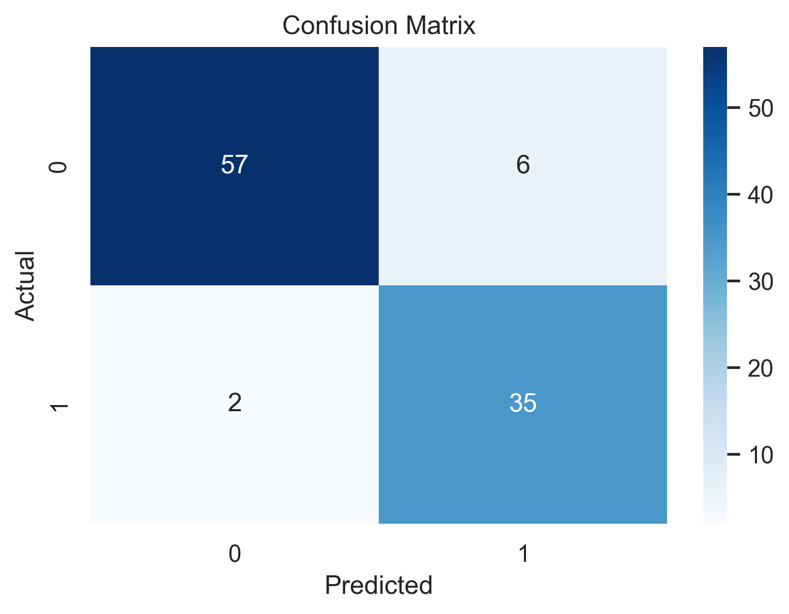
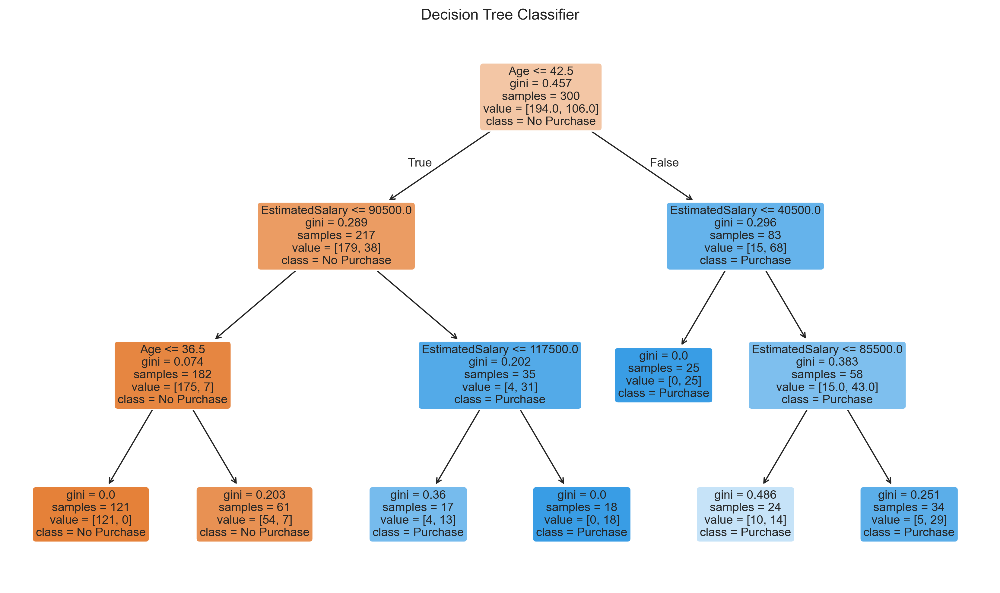

# PRODIGY_DS_03
# 🌳 Customer Purchase Prediction using Decision Tree
## Task 3 - Prodigy InfoTech Data Science Internship

## 📌 Project Overview
Built a Decision Tree Classifier to predict whether a customer will purchase a product based on demographic data.

## 📂 Dataset Used
Social Network Ads Dataset

Features:
- Gender
- Age
- Estimated Salary

Target:
- Purchased (0 / 1)

## ⚙️ Steps Performed
- Loaded dataset
- Encoded categorical values
- Train-test split
- Trained Decision Tree model
- Evaluated accuracy
- Visualized confusion matrix
- Visualized decision tree

## 📊 Outputs

### Confusion Matrix

### Decision Tree

## 🛠 Tools Used
- Python
- Pandas
- Scikit-learn
- Matplotlib
- Seaborn
- Jupyter Notebook

## 🙏 Acknowledgement
Thanks to Prodigy InfoTech for this learning opportunity.

## 👩‍💻 Author
Aanya Kathuria
